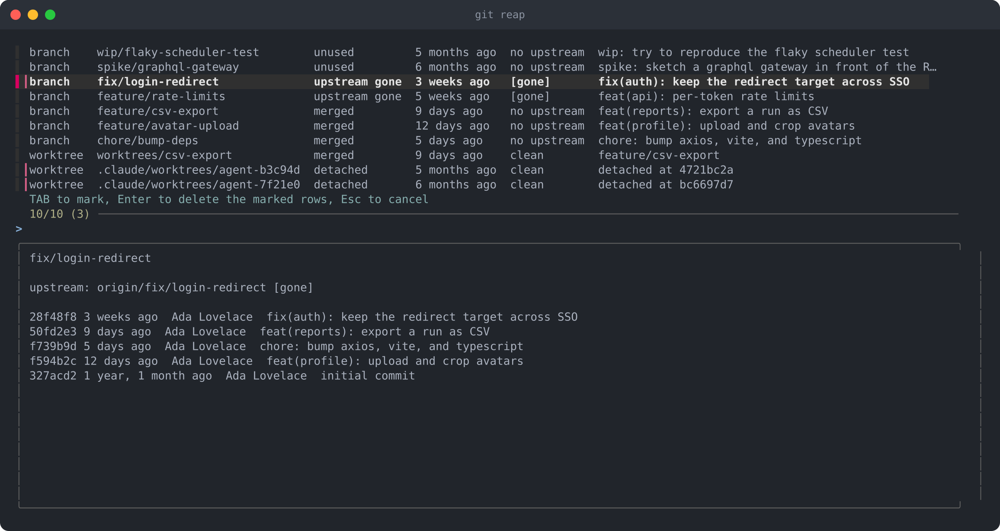

I wrote [git-reap](https://github.com/m-d-brown/git-reap) because
`git branch --merged | xargs git branch -d` in my dotfiles stopped being enough.
It didn't handle branches that aren't merged but are finished anyway, and
worktrees. I also wanted a clean interface, which many of the other "git
cleanup" alternatives don't provide.

Worktree cleanup became important when I started using agents more. Claude Code
and similar tools leave detached worktrees under `.claude/worktrees`, and they
accumulate quietly. A worktree also pins the branch it has checked out, so git
refuses to delete that branch — which means a branch-only cleanup can't finish
the job.

`git reap` finds four kinds of leftovers in one pass, shows you what it found,
and deletes only what you mark. I particularly like the integration with `fzf`
to provide a clean, clear way to select what to clean up.



## What it considers dead

| Reason          | What it means                                                  |
| --------------- | -------------------------------------------------------------- |
| `merged`        | already contained in the base branch                           |
| `upstream gone` | the remote branch was deleted — what a squash-merged PR leaves |
| `unused`        | no commits in the last `--days` days (90 by default)           |
| `detached`      | a clean worktree on a detached HEAD, idle for `--days` days    |

Detached worktrees are matched by age, not by path, so it doesn't care where
your agent tooling puts them. Worktrees are removed before branches, for the
reason above.

Never touched: the base branch, the branch you're on, the branch the main
worktree holds, the main worktree itself, and any worktree that's locked, dirty,
or currently in use.

## Using it

Install:

```sh
go install github.com/m-d-brown/git-reap@latest
```

Anything named `git-reap` on your `PATH` is reachable as `git reap`, so that's
the whole installation. [fzf](https://github.com/junegunn/fzf) drives the
picker; without it, `--dry-run` and `--all` still work.

```sh
git reap                # pick through the candidates
git reap -n             # just look, and see what was skipped and why
git reap -a -y          # take everything, no questions
git reap -d 30          # count a month of silence as unused
git reap develop        # measure "merged" against develop
```

<kbd>TAB</kbd> marks a row, <kbd>Enter</kbd> deletes what's marked,
<kbd>Esc</kbd> walks away. The preview pane shows the recent history of whatever
the cursor is on, which is usually enough to remember what a six-month-old spike
branch was for.

`--dry-run` also reports its omissions, which is where the interesting
information tends to be:

```text
worktree  worktrees/csv-export            merged    9 days ago    clean        feature/csv-export
worktree  .claude/worktrees/agent-7f21e0  detached  6 months ago  clean        detached at 1baafd65
branch    chore/bump-deps                 merged    5 days ago    no upstream  chore: bump axios, vite, and typescript
kept    worktree /src/checkout-service/.claude/worktrees/agent-e5a018 (detached but recent)
```

## A couple of implementation notes

Each run starts with `git fetch --prune`. That's what makes `[gone]` mean
anything: until the remote refs are pruned, a branch whose upstream was deleted
still looks alive. `--no-fetch` skips it when you're offline.

Merged branches are deleted with `git branch -d`, so git gets the last word.
`upstream gone` and `unused` branches aren't merged as far as git is concerned,
so those need `-D`. A branch that's both merged and idle is reported as merged,
since that's the gentler of the two.

Source and issues at
[github.com/m-d-brown/git-reap](https://github.com/m-d-brown/git-reap).
